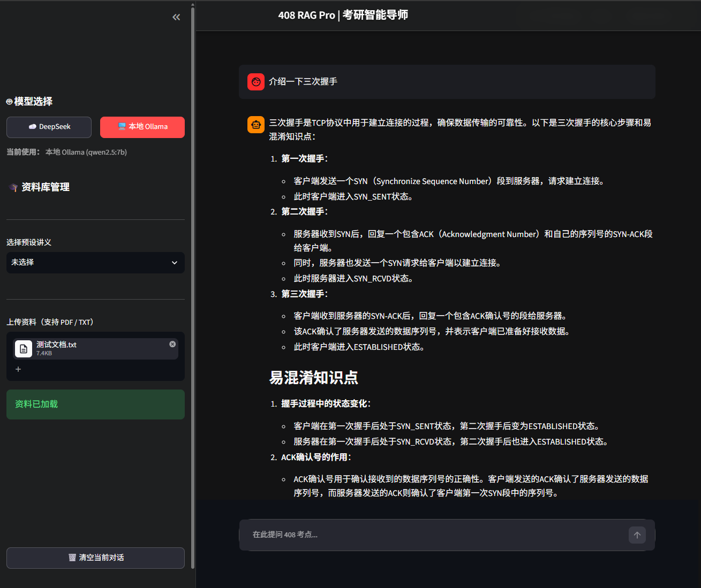

# KnowMate-RAG Assistant
> Local-First Knowledge Base Assistant

[](https://www.python.org/downloads/)
[](LICENSE)
[](https://streamlit.io/)
[](https://ollama.com/)

KnowMate 是一个面向强知识领域场景的本地 RAG 助手框架，可用于教育、医疗、法律等需要知识检索和引用的场景。

---
## DEMO




## 🌟 Core Features

### Local RAG Pipeline
- **Document Parsing** — PDF / TXT files
- **Text Chunking** — RecursiveCharacterTextSplitter
- **Vector Retrieval** — Chroma + bge-m3 (Ollama)
- **Cross Encoder Reranking** — bge-reranker-v2-m3 (sentence-transformers)
- **LLM Generation** — Qwen2.5 / DeepSeek-R1 (Ollama) / DeepSeek API

### Privacy-first Design
- Ollama local inference
- Local vector database
- Documents remain locally
- Optional Cloud API fallback

### Domain Adaptation
- 408 Computer Science
- Medical documents
- Legal documents

---

## 🏗️ Architecture

```
User Query
  ↓
Streamlit Frontend
  ↓
┌─────────── RAG Pipeline ───────────┐
│  ① Document Parsing (PyMuPDF)     │
│  ② Text Chunking (TextSplitter)   │
│  ③ Vector Retrieval (Chroma)      │
│  ④ Cross Encoder Reranking        │
│  ⑤ LLM Generation                 │
└────────────────────────────────────┘
  ↓
Ollama Local Models / DeepSeek API
```

### Tech Stack

| Layer | Technology |
|-------|-----------|
| UI | Streamlit |
| Document Parsing | PyMuPDF / langchain-text-splitters |
| Vector Retrieval | Chroma + bge-m3 (Ollama) |
| Reranking | bge-reranker-v2-m3 (sentence-transformers) |
| LLM | qwen2.5:7b / deepseek-r1:14b (Ollama) |

---

## 🚀 Quick Start

### Prerequisites

- Python 3.11+
- [Ollama](https://ollama.com/)

### Installation

```bash
git clone https://github.com/ya1u737/KnowMate-RAG-assistant.git
cd KnowMate-RAG-assistant
pip install -r requirements.txt
```

### Model Setup

```bash
# Chat model (choose one)
ollama pull qwen2.5:7b
# or:
ollama pull deepseek-r1:14b

# Embedding model
ollama pull bge-m3

# Reranker model (auto-downloaded from HuggingFace on first run)
```

### Run

```bash
streamlit run app.py
```

Open `http://localhost:8501` in your browser.

---

## ⚙️ Configuration

```bash
cp .env.example .env
```

Edit `.env` to set DeepSeek API Key (optional):

```
DEEPSEEK_API_KEY=sk-your-key-here   # leave empty for local Ollama
USE_API=false                        # set true to use DeepSeek API
```

### Parameters

| Parameter | Default | Description |
|-----------|---------|-------------|
| `CHAT_MODEL` | `qwen2.5:7b` | Ollama chat model |
| `EMBEDDING_MODEL` | `bge-m3` | Ollama embedding model |
| `RERANKER_MODEL` | `bge-reranker-v2-m3` | Cross encoder model path |
| `RETRIEVAL_TOP_K` | 5 | Candidate count for retrieval |
- [ ] Hybrid Search（BM25 + 向量）
- [ ] 引用增强（标记文档来源）
- [ ] 多知识库隔离切换
- [ ] 医疗 / 法律领域适配模板
- [ ] Docker 一键部署
- [ ] 单元测试覆盖

---

## 📄 License

MIT License. 详见 [LICENSE](LICENSE)

---

*Made with ❤️ for privacy-first RAG.*